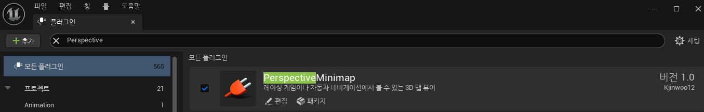
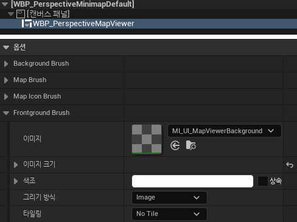
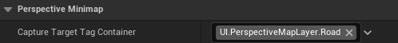
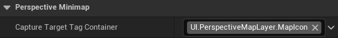
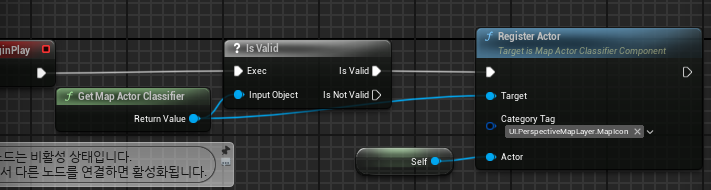
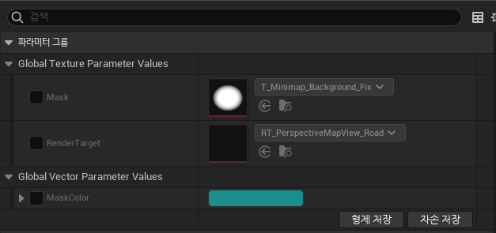

# PerspectiveMinimap for UE5

# Reference
`Content/Maps/PerspectiveMinimapTest.umap`

# How to use
### 1. Add this plugin on your project

### 2. Add widget `WBP_PerspectiveMapViewer`

You can see three brush options on the details. The PerspectiveMapViewer uses 4 brushes. Background Brush and Foreground Brush are simple. It is just for decoration.
But the Map Brush and Map Icon Brush are very important. The material used for this brushes are core features of this plugin.

### 3. Add `PerspectiveMapCaptureComponent` for capture the road.

You have to set GamePlay Tag Container what you want to show on minimap as the road.
Don't forget to add RenderTarget. Or you can use the default RenderTarget `RT_PerpectiveMapView_Road`

### 4. Add `PerspectiveMapCaptureComponent` for capture the Map Icon.

You have to set GamePlay Tag Container what you want to show on minimap as the MapIcon.
Don't forget to add RenderTarget. Or you can use the default RenderTarget `RT_PerpectiveMapView_MapIcon`

### 5. Register Actor for `PerspectiveMapCaptureComponent`

Use `GetMapActorClassifier->RegisterActor`. The actor you added will be used by `PerspectiveMapCaptureComponent`.

### 6. Create a new Material instance which inherits `M_UI_PerspectiveMapView_Road`
You can use the default material instances `MI_UI_PerspectiveMapView_Road` or `MI_UI_PerspectiveMapView_MapIcon`.
If you have 2 or more capture cameras, You must create new material instances as same as number of cameras.

### 7. Set your RenderTarget on your Material Instance.

You can find options on your Material Instance.